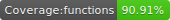

# React Native User Avatar

[](https://www.npmjs.com/package/react-native-user-avatar)
[](https://www.npmjs.com/package/react-native-user-avatar)
[](https://travis-ci.org/avishayil/react-native-user-avatar)





A bare-bones user avatar display with support for falling back to using the user's initials on a colored background as the avatar.
Based on the great library for React: https://github.com/wbinnssmith/react-user-avatar, and ported to React Native.

iOS Screenshot             | Android Screenshot
:-------------------------:|:-------------------------:
 | 

## Installation

`npm install --save react-native-user-avatar` or `yarn add react-native-user-avatar`

## Usage

The fallback avatar's color may be set by passing in the `bgColor` prop, or you can customize the range of colors
used by passing in an array of `bgColors`. The component uses a simple calculation to consistently use the same
color for the same user's name every time.

### UserAvatar Component

```jsx
import UserAvatar from 'react-native-user-avatar';

const App: () => React$Node = () => {
  return (
    <>
    ...
    <View>
      <UserAvatar size={100} name="Avishay Bar" />
      <UserAvatar size={100} name="Avishay Bar" src="https://dummyimage.com/100x100/000/fff" />
      <UserAvatar size={50} name="John Doe" bgColors={['#ccc', '#fafafa', '#ccaabb']}/>
      <UserAvatar size={50} name="John Doe" />
      <UserAvatar size={50} name="Jane Doe" bgColor="#000" />
    </View>
    ...
```

### UserAvatar Props

Attribute        | Type            | Default Value | Description
---------------- | --------------- | ------------- | -----------
`name`           | string          | `'John Doe'`  | name used for generating initials
`src`            | string          | `undefined`   | source image on the internet to display
`bgColor`        | string          | `undefined`   | custom background color for the initials
`bgColors`       | array           | see index.js  | custom array of background colors to choose from
`textColor`      | string          | `'#fff'`      | custom text color for the initials font
`size`           | number          | `32`          | custom size that defines both the avatar and the initials font size
`imageStyle`     | object          | `undefined`   | custom image styling to append to the `Image` component displays the source image
`textStyle`      | object          | `undefined`   | custom text styling to append to the `Text` component that displays initials
`style`          | object          | `undefined`   | custom style to append to the `UserAvatar` component container
`borderRadius`   | number          | `size * 0.5`  | custom border radius for the component
`component`      | React.Component | `undefined`   | custom component to display instead of initials or source image

## Contributing

Contributions are welcome. Please see [CONTRIBUTING.md](CONTRIBUTING.md) if you like to contribute to this library.

## Credits

[@wbinnssmith](https://github.com/wbinnssmith/) for creating [https://github.com/wbinnssmith/react-user-avatar](react-user-avatar)

## License

MIT
