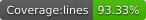
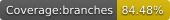
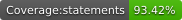
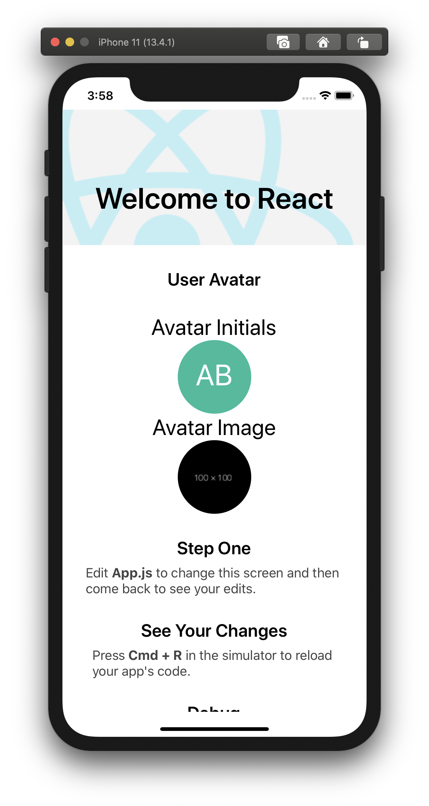

# React Native User Avatar

[](https://www.npmjs.com/package/react-native-user-avatar)
[](https://www.npmjs.com/package/react-native-user-avatar)
[](https://github.com/avishayil/react-native-user-avatar/actions/workflows/ci.yml)
[](https://www.typescriptlang.org/)
[](./LICENSE)






A bare-bones user avatar component that falls back to the user's initials on a
deterministic colored background. Works on **iOS, Android, and Web**, ships with
**TypeScript types**, and has **no runtime polyfills** — it uses the global
`fetch`/`AbortController` available in modern React Native.

Inspired by [react-user-avatar](https://github.com/wbinnssmith/react-user-avatar) and ported to React Native.

iOS Screenshot             | Android Screenshot
:-------------------------:|:-------------------------:
 | 

## Installation

```sh
npm install react-native-user-avatar
# or
yarn add react-native-user-avatar
```

`react` and `react-native` are peer dependencies — this library uses whatever
version your app already has installed. No extra native setup is required; it is
a pure JavaScript component.

## Usage

The fallback avatar's color can be set with the `bgColor` prop, or customized by
passing an array of `bgColors`. The same name always maps to the same color.

```tsx
import UserAvatar from 'react-native-user-avatar';
import { View } from 'react-native';

export default function App() {
  return (
    <View>
      <UserAvatar size={100} name="Avishay Bar" />
      <UserAvatar
        size={100}
        name="Avishay Bar"
        src="https://dummyimage.com/100x100/000/fff"
      />
      <UserAvatar size={50} name="John Doe" bgColors={['#ccc', '#fafafa', '#ccaabb']} />
      <UserAvatar size={50} name="John Doe" />
      <UserAvatar size={50} name="Jane Doe" bgColor="#000" />
    </View>
  );
}
```

### TypeScript

Types are bundled — no `@types/*` package is needed. You can import the prop type:

```tsx
import UserAvatar, { UserAvatarProps } from 'react-native-user-avatar';
```

### Props

| Attribute           | Type                       | Default        | Description |
| ------------------- | -------------------------- | -------------- | ----------- |
| `name`              | `string`                   | `'John Doe'`   | Name used to generate the initials. |
| `src`               | `string`                   | `undefined`    | Remote image URL. Shown when it resolves to a valid image. |
| `bgColor`           | `string`                   | `undefined`    | Force a specific background color for the initials. |
| `bgColors`          | `string[]`                 | built-in palette | Palette the deterministic background color is picked from. |
| `textColor`         | `string`                   | `'#fff'`       | Color of the initials text. |
| `size`              | `number`                   | `32`           | Avatar width/height and initials font scale. |
| `imageStyle`        | `StyleProp<ImageStyle>`    | `undefined`    | Extra style applied to the image. |
| `textStyle`         | `StyleProp<TextStyle>`     | `undefined`    | Extra style applied to the initials text. |
| `style`             | `StyleProp<ViewStyle>`     | `undefined`    | Extra style applied to the outer container. |
| `borderRadius`      | `number`                   | `size / 2`     | Border radius of the avatar (defaults to a circle). |
| `component`         | `ReactNode`                | `undefined`    | Render a custom element instead of initials/image. |
| `noUpperCase`       | `boolean`                  | `false`        | Keep initials in their original case. |
| `ignoreContentType` | `boolean`                  | `false`        | Skip the `image/*` content-type check on `src` (e.g. for S3 URLs without an extension). |

### Web & Expo

The component works in Expo and `react-native-web` projects without extra
configuration. See the [`Example/`](./Example) app for a runnable Expo demo
(iOS, Android, and Web).

## Migrating from v1 to v2

v2 is a modernization release. It is a drop-in replacement for most apps, but note:

- **`react`/`react-native` are now peer dependencies.** They are no longer bundled
  as hard dependencies, so your app's versions are always used.
- **Polyfills removed.** `abortcontroller-polyfill` and `node-fetch` are gone; the
  component relies on the global `fetch`/`AbortController` (available in RN ≥ 0.60).
- **`textStyle` now works reliably**, including after the initial render ([#117](https://github.com/avishayil/react-native-user-avatar/issues/117)).
- **Fewer console warnings** — no `defaultProps` deprecation warning, and aborted
  image fetches no longer log.
- **TypeScript types are correct and bundled** ([#114](https://github.com/avishayil/react-native-user-avatar/issues/114), [#129](https://github.com/avishayil/react-native-user-avatar/issues/129)).
- Initials are now capped at **3 characters**.

## Contributing

Contributions are welcome — see [CONTRIBUTING.md](CONTRIBUTING.md). Working in this
repo with an AI assistant? Start from [CLAUDE.md](CLAUDE.md).

## Credits

[@wbinnssmith](https://github.com/wbinnssmith/) for creating [react-user-avatar](https://github.com/wbinnssmith/react-user-avatar).

## License

[MIT](./LICENSE)
